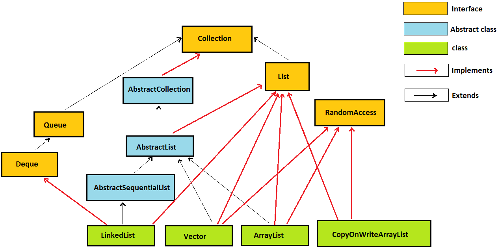
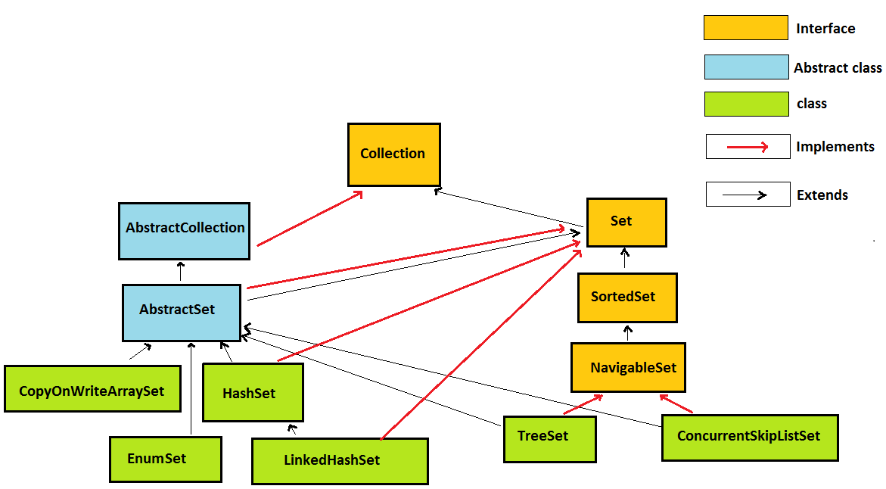
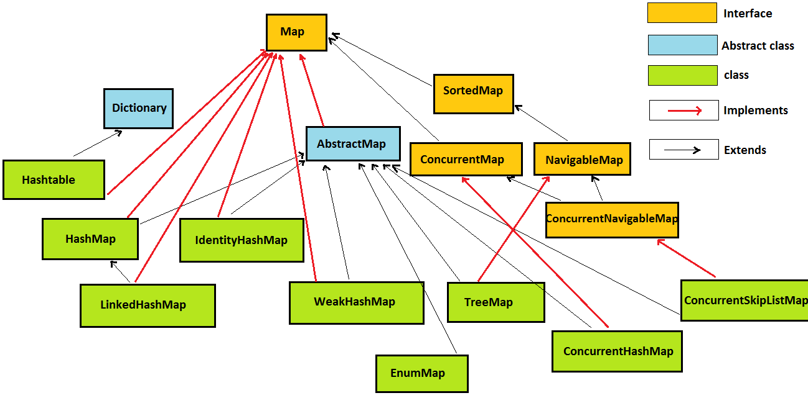

## Collection interview Question 9. 

	What are core classes and interfaces in java.util.List hierarchy in java?
	
##### Answer
	Freshers must know core classes in List hierarchy but experienced developers 
	must be able to explain this java.util.List hierarchy in detail.
	
	java.util.List interface extends java.util.Collection interface.

	Also some abstract classes like 
		java.util.AbstractCollection, 	
		java.util.AbstractList and 
		java.util.AbstractSequentialList 
	have been mentioned in hierarchy.
	
### java.util.List的实现类 	
	线程不安全:
		java.util.ArrayList
			底层数据结构：数组 Object[] elementData
			默认初始容量：DEFAULT_CAPACITY = 10;
			
		java.util.LinkedList  
			底层数据结构：链表 Node<E> first

	线程安全：
		java.util.Vector
			由synchronized提供同步支持
			底层数据结构：Object[] elementData
			默认初始容量：10;
			
		java.util.concurrent.CopyOnWriteArrayList
			高并发，采用写时复制策略
			适用于读多写少的情况
	

---

## Collection interview Question 10. 

	What are core classes and interfaces in java.util.Set hierarchy?
	
### Answer
	Freshers must know core classes in Set hierarchy but experienced developers 
	must be able to explain this java.util.Set hierarchy in detail.
	
	java.util.Set interface extends java.util.Collection interface.
	
	Also some abstract classes like 
		java.util.Dictionary and 
		java.util.AbstractSet and 
		java.util.AbstractCollection 	
	have been mentioned in hierarchy.
	
### java.util.Set 的子类
	非线程安全:
		java.util.HashSet
			基于哈希表的Set，元素不可排序，元素不重复
			
		java.util.LinkedHashSet
			基于哈希表的Set，元素不可排序，元素不重复
			但是，保留了元素添加的顺序
			
		java.util.TreeSet
			底层数据结构：红黑树，元素支持排序，元素不重复
		
		java.util.EnumSet 
			元素是枚举类型
		
	
	线程安全:
	java.util.concurrent.CopyOnWriteArraySet
		高并发，采用写时复制策略
		适用于读多写少的情况
	
	java.util.concurrent.ConcurrentSkipListSet
		高并发、可导航、可排序的Set

	
	
---

## Collection interview Question 11. 

	What are core classes and interfaces in java.util.Map hierarchy?

### Answer	
	java.util.Map interface extends java.util.Collection interface.
	
	Also some abstract classes like 
		java.util.Dictionary and 
		java.util.AbstractMap 
	have been mentioned in hierarchy.
	

### java.util.Map interface 的子类
	非线程安全:
		java.util.HashMap	
			非线程安全的哈希表
			依赖 hashCode() + equals()的实现
			HashMap是否高效，hashcode起到了决定性的作用:
				hashCode()决定了Entry在数组中的索引位置
				如果发生hash冲突，则使用equals()比较同一个链条上是否存在相同的key
				如果存在，则替换，否则加入到链表末尾
			底层数据结构：Entry[] table
			默认初始容量：DEFAULT_INITIAL_CAPACITY = 1 << 4; // aka 16
	
		java.util.LinkedHashMap
			在HashMap的基础上，增加了保留元素插入顺序的功能。
			底层通过额外的双向链表来实现。
		
		java.util.TreeMap
			可排序的Map，Entry按key进行排序，可指定排序规则：Comparator，或者元素实现Comparable

		java.util.IdentityHashMap
			Map的key的是否相等的比较规则：不再是通过equals()方法，而是直接判断reference引用
		
		java.util.WeakHashMap
			与GC回收相关，元素合适被清除具有不确定性
			
		java.util.EnumMap
			Map的key是枚举类型

	线程安全:
		java.util.Hashtable	
			多线程安全的哈希表，由synchronized提供同步支持
			底层数据结构：Entry<?,?>[] table
			
		java.util.concurrent.ConcurrentHashMap 
			多线程安全的哈希表，由提供同步支持
			底层数据结构：Segment<K,V>[] segments
								HashEntry<K,V>[] table
			默认初始容量：DEFAULT_INITIAL_CAPACITY = 16;
			默认扩容因子：DEFAULT_LOAD_FACTOR = 0.75f;
			默认并发级别：DEFAULT_CONCURRENCY_LEVEL = 16; // Segment数组的大小
			
		java.util.concurrent.ConcurrentSkipListMap
			多线程、可排序、可导航
			底层数据结构：SkipList 多层次链表
			
	

	