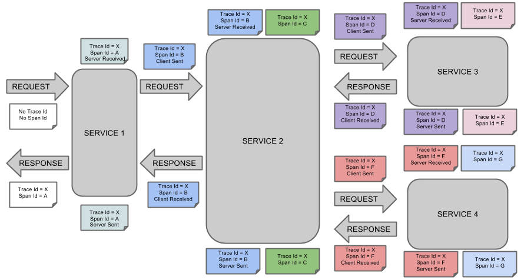

[Spring Cloud Sleuth](http://cloud.spring.io/spring-cloud-static/spring-cloud-sleuth/1.3.3.RELEASE/single/spring-cloud-sleuth.html)

## Google Dapper
	Sleuth基于Google Dapper论文进行实现

## Spring Cloud Sleuth 用来做什么？
	完整监控链路跟踪：一个请求到返回响应，所经过的完整链路，以及每个服务的响应时间（RT值）；
		日志排查：处理请求失败，需要快速定位到是链路中哪个环节出现了异常；
		性能监控 ：检查链路中每个服务的响应耗时

## 引入Maven依赖
	<dependency>
		<groupId>org.springframework.cloud</groupId>
		<artifactId>spring-cloud-starter-sleuth</artifactId>
	</dependency> 

## 应用日志发生的变化
	当应用的classpath下存在spring-cloud-starter-sleuth时，日志会发生变化。 

>	MDC: Mapped Diagnostic Context (映射诊断上下文)

	整体流程：
		sleuth会自动装配一个名为TraceFilter组件，该组件会调整当前日志系统(slf4j)的MDC，
		在记录日志的时候，会自动增加相关的链路跟踪数据到输出的日志中。	
	INFO [spring-cloud-sleuth,65500ff0479b72e6,65500ff0479b72e6,false] 5648 
	日志中新增部分的说明：	
		spring-cloud-sleuth,	应用程序的名称，由spring.applicaiton.name决定
		65500ff0479b72e6,		traceId，整个链路唯一
		65500ff0479b72e6,		spanId，发生特定操作所在系统的id
		false	是否日志可以输出到Zipkin

### SpanLogger 日志扩展的实现
	org.springframework.cloud.sleuth.log.Slf4jSpanLogger
	
	@Override
	public void logStartedSpan(Span parent, Span span) {
		MDC.put(Span.SPAN_ID_NAME, Span.idToHex(span.getSpanId()));
		MDC.put(Span.SPAN_EXPORT_NAME, String.valueOf(span.isExportable()));
		MDC.put(Span.TRACE_ID_NAME, span.traceIdString());
		log("Starting span: {}", span);
		if (parent != null) {
			log("With parent: {}", parent);
			MDC.put(Span.PARENT_ID_NAME, Span.idToHex(parent.getSpanId()));
		}
	}
	
	...

***

***

#### 相关应用端口信息：
		config-server 10000
		eureka-server 12345
		person-client  8080
		person-service 9090
		spring-cloud-zuul 7070
		spring-cloud-sleuth	6060
		zipkin-server 10110

#### 服务启动顺序
	1、Zipkin Server
		（提供UI显示请求的完整链路）
	2、Eureka Server
		（服务注册与发现）
	3、spring-cloud-config-server
		（配置中心，zuul从配置中心获取person服务的调用地址）
	4、person-service
		(person服务的提供端)
	5、person-client
		(person服务客户端：从eureka获取person-service的服务地址，调用person-service)
	6、spring-cloud-zuul
		（网关：从Eureka获取zuul.routes的相关配置，比如person-client的URI路径匹配模式）
	7、spring-cloud-sleuth
		(客户端：从Eureka获取网关地址，调用网关)

------------------------------------------
## Zipkin 整合
	1、Zipkin Server: 具体配置参考spring-cloud-zipkin-server。
	2、在需要向Zipkin Server上报数据的项目中，加入Zipkin的客户端。
	3 、客户端向zipkin上报数据有两种方式：
			HTTP
			Stream (Kafka/RabbitMQ)

-----
### 1、HTTP - 简单，但是效率不高，受网络影响比较
	日志以HTTP方式发送到zipkin server上，完成日志的上报。
	
### 2、Stream - Kafka
	应用程序将日志发送到kafka上，完成日志的上报。
	
-----

### 扩展： Logger 本地日志（另一种通过日志来对系统进行监控的方案）
	扩展log4j/logback日志框架，将日志写入本地文件，再将日志收集到hadoop中，做一些统计分析。
	// TODO
